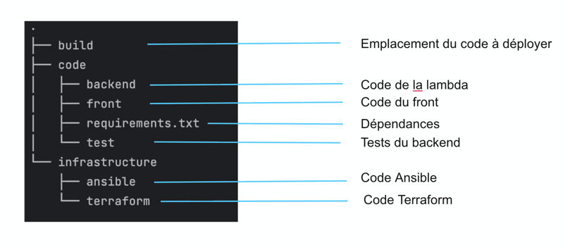
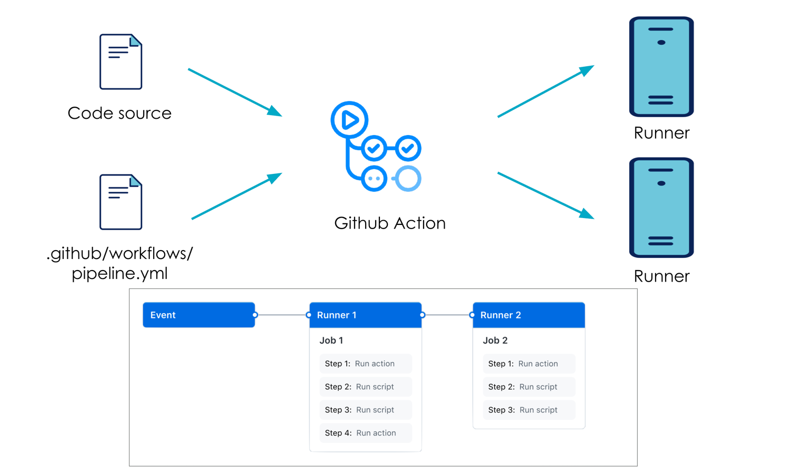

### ATELIER: Application Trois tiers

Dans cette première partie, nous allons créer une application front avec un backend déployé sur une lambda en utilisant Ansible et Terraform.

- **Ansible** va nous permettre de packager notre code front et backend au format zip.
  - Dans une perspective de déploiement avec une CI/CD, Ansible sera utilisé pour décompresser le zip du front avant de le déployer.
- **Terraform** va nous permettre de créer l'ensemble de l'infrastructure décrite dans le schéma ci-dessous :


Structure du projet



## Partie 1 : Packaging avec Ansible

1. Prenez le temps de parcourir le code front et backend situés dans le dossier **code**.

2. Créez deux playbooks Ansible permettant de créer les archives zip du front et du backend avec la bonne version et, si nécessaire, de décompresser le front.

3. Dans le fichier **create_front_and_backend_archives.yml** situé dans le dossier **infrastructure/ansible**, ajoutez une tâche pour créer un dossier **build** :

   - **Emplacement du dossier** : `../../build`

```yaml
    # Ajouter le role pour créer le dossier build
    - include_role:
        name: "create_folder"
      vars:
        dossier: "../../build"
```

4. Dans le fichier **create_front_and_backend_archives.yml**, ajoutez une tâche pour créer l'archive du backend :

   - **dossier_source** : `../../build/backend-{{ version }}.zip`
   - **dossier_cible** : `../../code/backend`

```yaml
    # Ajouter le role pour créer une archive avec le code du backend
    - include_role:
        name: "zip_folder"
      vars:
        dossier_source: "../../build/backend-{{ version }}.zip"
        dossier_cible: "../../code/backend"
```

5. Dans le fichier **create_front_and_backend_archives.yml**, ajoutez une tâche pour créer l'archive du front :

   - **dossier_source** : `../../build/front-{{ version }}.zip`
   - **dossier_cible** : `../../code/front`

```yaml
    # Ajouter le role pour créer une archive avec le code du front
    - include_role:
        name: "zip_folder"
      vars:
        dossier_source: "../../build/front-{{ version }}.zip"
        dossier_cible: "../../code/front"
```

6. Générez les archives backend et front avec la commande `ansible-playbook`.

```bash
ansible-playbook atelier/infrastructure/ansible/create_front_and_backend_archives.yml -e version=${{ env.VERSION }}
```

7. Dans le fichier **unzip_archive**, ajoutez une tâche pour décompresser l'archive du front :

   - **dossier_source** : `./front-{{ version }}.zip`
   - **dossier_cible** : `./front_extracted`
   - **emplacement** : `../../build`

```yaml
    - include_role:
        name: "unzip_folder"
      vars:
        dossier_source: "./front-{{ version }}.zip"
        dossier_cible: "./front_extracted"
        emplacement: "../../build"
```

8. Vérifiez que le playbook fonctionne en utilisant la commande `ansible-playbook`.

```bash
ansible-playbook atelier/infrastructure/ansible/unzip_archive.yml -e version=${{ env.VERSION }}
```


## Partie 2 : Création de l'infrastructure avec Terraform

1. Dans le fichier **main.yaml**, modifiez la valeur `<changer-le-nom>` de la variable locale `component_name` avec une 
valeur qui vous est propre.

2. Créez un bucket S3 pour héberger le code du front :
   - **Nom du bucket** : `s3-${local.component_name}`

3. Rattachez les ressources suivantes au bucket précédemment créé :
   - `aws_s3_bucket_website_configuration`
   - `aws_s3_bucket_public_access_block`
   - `aws_s3_bucket_policy` ( ! N'oubliez pas le champ Resource dans le Statement)

4. Chargez les fichiers suivants dans le bucket :
   - **Nom du fichier** : `index.html`, **content_type** : `text/html`
   - **Nom du fichier** : `script.js`, **content_type** : `application/javascript`
   - **Nom du fichier** : `style.css`, **content_type** : `text/css`

5. Créez une fonction Lambda avec les propriétés suivantes :
   - **function_name**    : `lambda-${local.component_name}`
   - **role**             : `aws_iam_role.lambda_exec.arn`
   - **handler**          : `lambda_function.lambda_handler`
   - **runtime**          : `python3.8`
   - **filename**         : `../../build/backend-${var.version_backend}.zip`
   - **source_code_hash** : `filebase64sha256("../../build/backend-${var.version_backend}.zip")`

```terraform
resource "aws_lambda_function" "proverb_lambda" {
  function_name    = "lambda-${local.component_name}"
  role             = aws_iam_role.lambda_exec.arn
  handler          = "lambda_function.lambda_handler"
  runtime          = "python3.8"
  filename         = "../../build/backend-${var.version_backend}.zip"
  source_code_hash = filebase64sha256("../../build/backend-${var.version_backend}.zip")
}
```

6. Appelez le module **apigateway**.

```terraform
module "api_gateway" {
  source                     = "./module"
  api_gateway_name           = "apitgwy-${local.component_name}"
  lambda_function_invoke_arn = aws_lambda_function.proverb_lambda.invoke_arn
  lambda_function_name       = aws_lambda_function.proverb_lambda.function_name
}
```

7. Créez l'infrastructure en utilisant la commande `terraform apply`.

8. En accédant à l'interface web et en appuyant sur le bouton, quel est le résultat ? Pouvez-vous l'expliquer ?

9. Modifiez la valeur du fichier `script.js` avec la bonne valeur dans le dossier **front_extracted**.

10. Relancez l'exécution avec la commande `terraform apply` et testez si tout fonctionne correctement.

----

## Partie 3 : Executer un workflow  CI/CD avec githubaction

Dans cette seconde partie, nous allons créer un pipeline CI/CD en utilisant GitHub Actions.
Ce pipeline nous permettra de simuler une chaîne complète d'intégration continue.

Dans le fichier .github/workflows/workflow.yml, nous allons créer deux jobs : ci et cd.

Le job ci va permettre de gérer l'intégration continue, tandis que le job cd assurera le déploiement continu.

